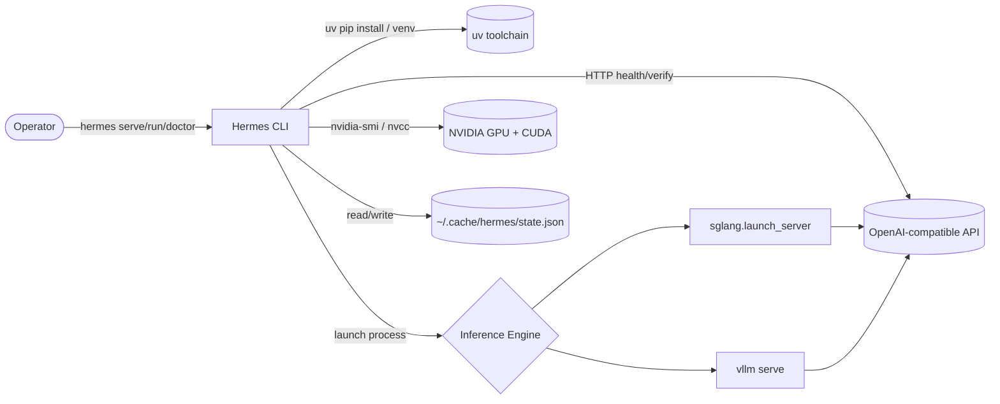
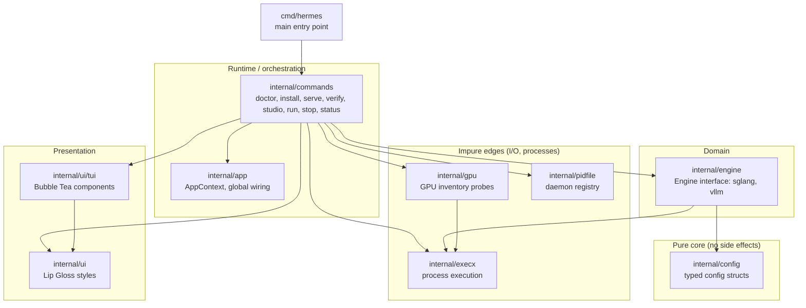
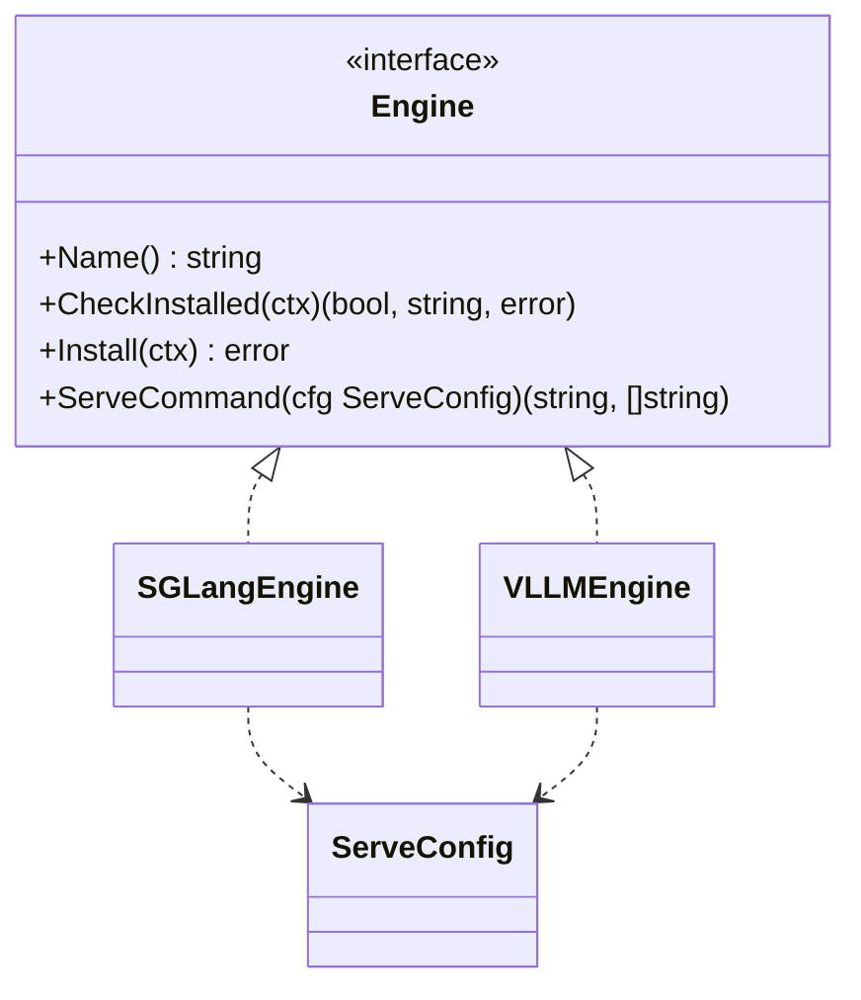
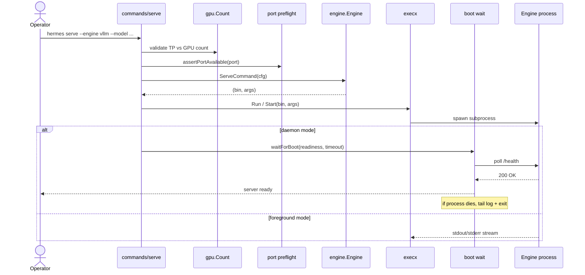
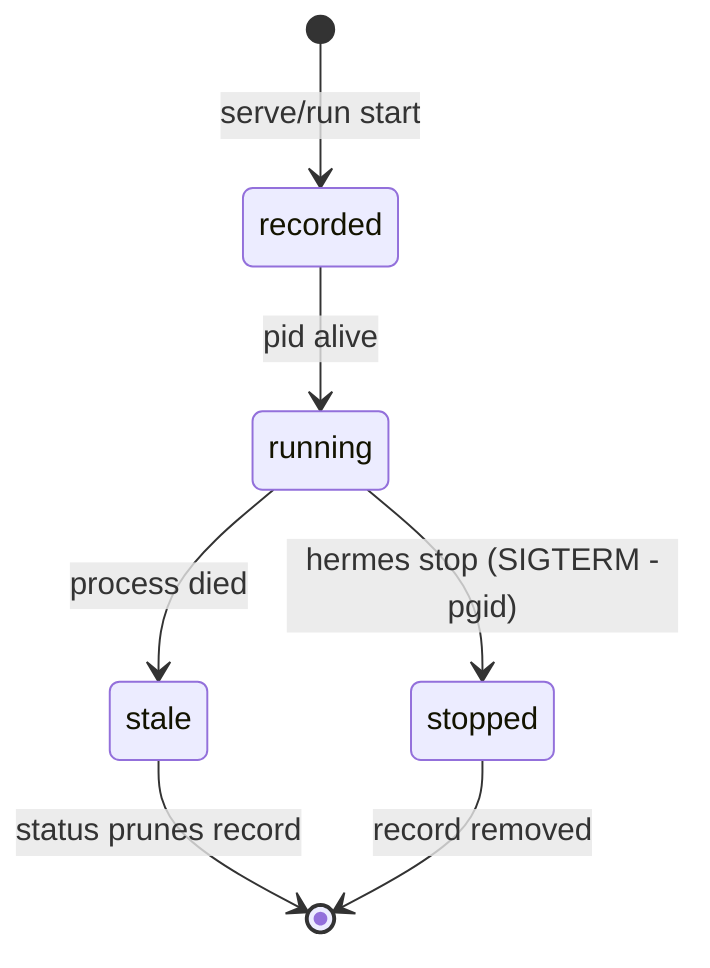

# ARCHITECTURE — Hermes CLI

> System shape, layer rules, and golden principles. This is ground truth for
> how code is allowed to depend on other code.

Hermes CLI is a GPU inference server launcher for **sglang** and **vllm**, built
in Go with the Charm ecosystem for terminal UI.

---

## 1. System Context

The CLI is an orchestrator: it never serves inference itself. It detects the
environment, installs engines via `uv`, launches the chosen engine as a
subprocess, and verifies the resulting OpenAI-compatible endpoint.

---

## 2. Layer Model

The Go packages map onto a classic inward-pointing dependency model. Adapt the
generic Types→Config→Repo→Service→Runtime→UI model to this codebase:

**Dependency direction rule:** arrows point from more-volatile to more-stable.
`config` depends on nothing internal. `engine` depends only on `config` and
`execx`. `gpu` depends only on `execx`. `cmd/hermes` is the only package
allowed to wire everything together.

---

## 3. Engine Abstraction

All inference backends implement one interface, so commands stay
engine-agnostic.

Adding a new engine means implementing `Engine` and registering it in
`engine.Get` — no command code changes.

---

## 4. Serve Flow

---

## 5. Daemon Lifecycle

Daemon and foreground launches both record a `pidfile.Record`
(`~/.cache/hermes/daemons/<port>.json`) so background engines can be managed
after the CLI exits. Foreground runs remove their record on shutdown; daemons
keep it until `hermes stop` or the process is found dead by `hermes status`.

- `hermes stop --port N` sends SIGTERM to the process group (negative pid) so
  engine worker children are terminated too, then removes the record.
- `hermes status` prunes records whose pid is no longer alive, then probes
  `/health` for each survivor.
- Foreground `hermes run` installs an ownership guard that cleans up the pidfile
  on Ctrl+C or unexpected exit, preventing orphaned daemon records.

---

## 6. Golden Principles (mechanical, linter-enforced)

| ID | Principle | Enforcement |
|----|-----------|-------------|
| **GP-1** | **Dependency direction is inward.** `config` imports nothing internal; `engine` imports only `config`/`execx`; only `cmd/hermes` wires the graph. | depguard rules in `.golangci.yml` + `go vet` |
| **GP-2** | **Entry points only wire.** `cmd/hermes` contains routing and flag parsing, never business logic. | Review + size budget |
| **GP-3** | **Errors carry context.** Wrap with `fmt.Errorf("...: %w", err)`; never discard errors silently (`_ =`) outside best-effort cleanup. | `go vet`, `errcheck` (golangci-lint) |
| **GP-4** | **No secrets in code.** Tokens, keys, and hosts come from flags/env, never literals. | trufflehog secret scan in CI |
| **GP-5** | **Context propagates.** Every blocking/process/HTTP call accepts `context.Context` from `AppContext.Ctx`. | Review; `contextcheck` lint |
| **GP-6** | **Side effects live at the edges.** Process spawning, file I/O, and network calls stay in `execx` and command adapters, not in `config`/`engine` pure logic. | Review + layer rule |

---

## 7. Technology Preferences

- **Language:** Go 1.24+ (`CGO_ENABLED=0`, static binary).
- **CLI:** custom subcommand router (no Cobra) — keep dependencies minimal.
- **UI:** Charm ecosystem (Bubble Tea, Bubbles, Lip Gloss, Huh).
- **Logging:** `charmbracelet/log` (structured, level-aware).
- **Engine install/runtime:** `uv` for Python venv + package management.
- **Build:** `just build`; quality gate `just check` (vet + test + build).

---

## 8. Where Decisions Live

- Architectural decisions: [`design-docs/index.md`](design-docs/index.md)
- Code conventions: [`DESIGN.md`](DESIGN.md)
- Security invariants: [`SECURITY.md`](SECURITY.md)
- Active work: [`exec-plans/active/`](exec-plans/active/)
