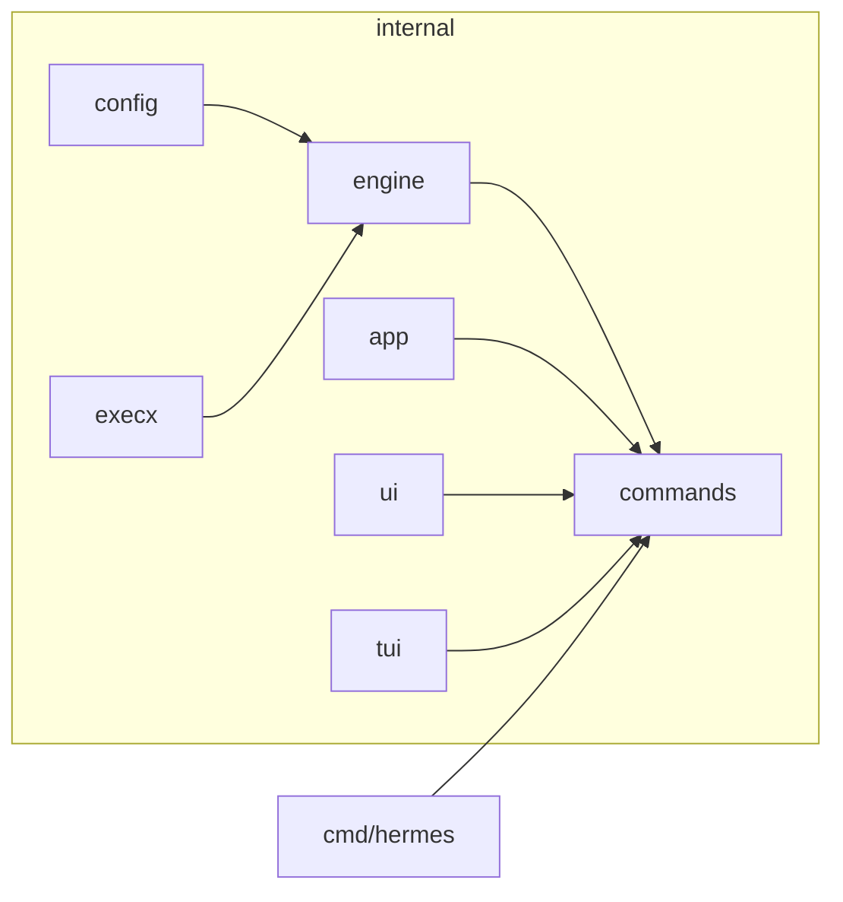
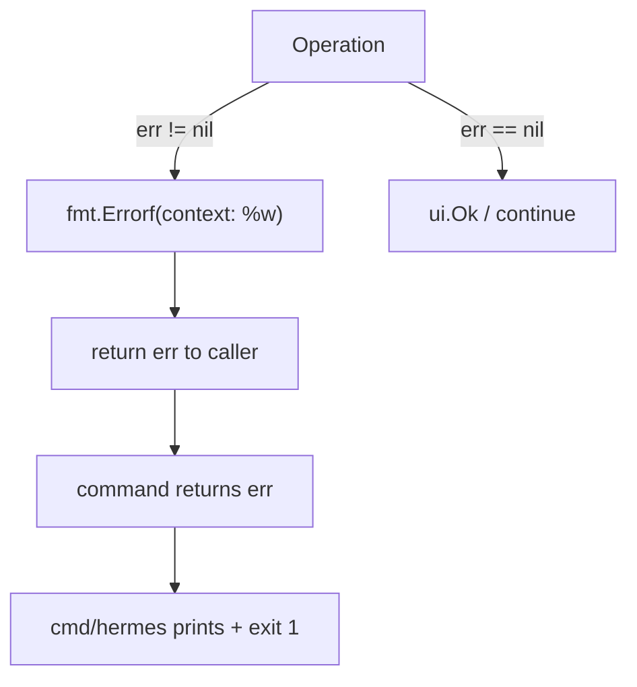

# DESIGN — Code Conventions

> How code is written in this repo. Architecture says *where* things go;
> this says *how* they look.

---

## 1. Go Style

- Format with `gofmt`/`go fmt` — non-negotiable, enforced in CI.
- Package names: short, lowercase, no underscores (`execx`, `engine`, `config`).
- Exported identifiers documented when their purpose is not obvious from the name.
- Prefer small interfaces defined where they are consumed (`Engine` in `engine`).
- Return errors, do not panic in library code. `cmd/hermes` may exit non-zero.
- Wrap errors with context: `fmt.Errorf("install vllm: %w", err)`.

## 2. File & Package Organisation



- One command per file in `internal/commands` (`serve.go`, `run.go`, ...).
- One engine implementation per file in `internal/engine` (`sglang.go`, `vllm.go`).
- Shared process helpers live only in `internal/execx`.

## 3. Command Pattern

Every subcommand follows the same shape:

```go
func Serve(ctx *app.AppContext, args []string) error {
    fs := flag.NewFlagSet("serve", flag.ExitOnError)
    // 1. define flags
    // 2. parse + validate (return error early)
    // 3. resolve engine via engine.Get(...)
    // 4. execute via execx, stream output through ui
    // 5. return error or nil
}
```

- Flags are parsed with the stdlib `flag` package (no Cobra).
- All user-facing output goes through `ui` helpers (`ui.Ok`, `ui.Warn`, `ui.Step`).
- All process work goes through `execx.Run` / `execx.Start` with the shared context.

## 4. Engine Command Construction

`ServeCommand` returns `(binary, args)` rather than running anything — this keeps
engines pure and testable, and lets commands decide foreground vs daemon.

```go
func (e *VLLMEngine) ServeCommand(cfg config.ServeConfig) (string, []string) {
    args := []string{"run", "vllm", "serve", cfg.Model, "--port", strconv.Itoa(cfg.Port)}
    if cfg.ExtraArgs != "" {
        args = append(args, strings.Fields(cfg.ExtraArgs)...)
    }
    return "uv", args
}
```

## 5. Logging Convention

- Use `charmbracelet/log` via `AppContext.Logger`.
- Structured key-value pairs: `logger.Warn("failed to save state", "error", err)`.
- User-facing status uses `ui.*`; diagnostics use the logger. Do not mix them.

## 6. Error Surfacing



## 7. Testing

- Tests live beside code as `*_test.go` (none yet — see QUALITY_SCORE.md).
- Prefer table-driven tests for `engine.ServeCommand` arg construction and
  `config` validation — they are pure and cheap to cover.
- `make test` runs `go test -v ./...`.
