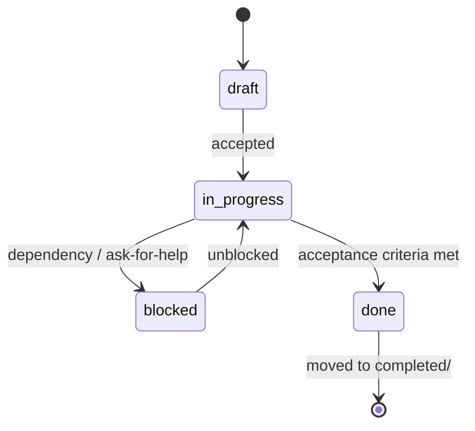

# PLANS — Exec-Plan Index

> What is being built right now. Each active plan lives in
> [`exec-plans/active/`](exec-plans/active/) and graduates to
> [`exec-plans/completed/`](exec-plans/completed/) when done.

---

## Active Plans

| Plan | Area | Status | Risk | Created |
|------|------|--------|------|---------|
| [2026-07-11 — llama.cpp Engine Support](exec-plans/active/2026-07-11-llamacpp-engine-support.md) | engine, commands, config | in_progress | medium | 2026-07-11 |
| [2026-06-28 — Initial Project Setup](exec-plans/active/2026-06-28-initial-setup.md) | Global — foundation | in_progress | low | 2026-06-28 |

## Completed Plans

| Plan | Area | Completed |
|------|------|-----------|
| [GPU setup and persistent config](exec-plans/completed/2026-08-18-gpu-setup-and-config.md) | commands, config, ui | 2026-08-18 |
| [Correctness fixes + initial tests](exec-plans/completed/2026-06-28-correctness-and-tests.md) | commands, app, engine, execx | 2026-06-28 |
| [Daemon mgmt + verify fix + lint tooling](exec-plans/completed/2026-06-28-daemon-mgmt-and-tooling.md) | pidfile, commands, ci | 2026-06-28 |

---

## Lifecycle

To create a new plan, copy [`exec-plans/_template.md`](exec-plans/_template.md)
into `exec-plans/active/{YYYY-MM-DD}-{slug}.md` and add a row above.
