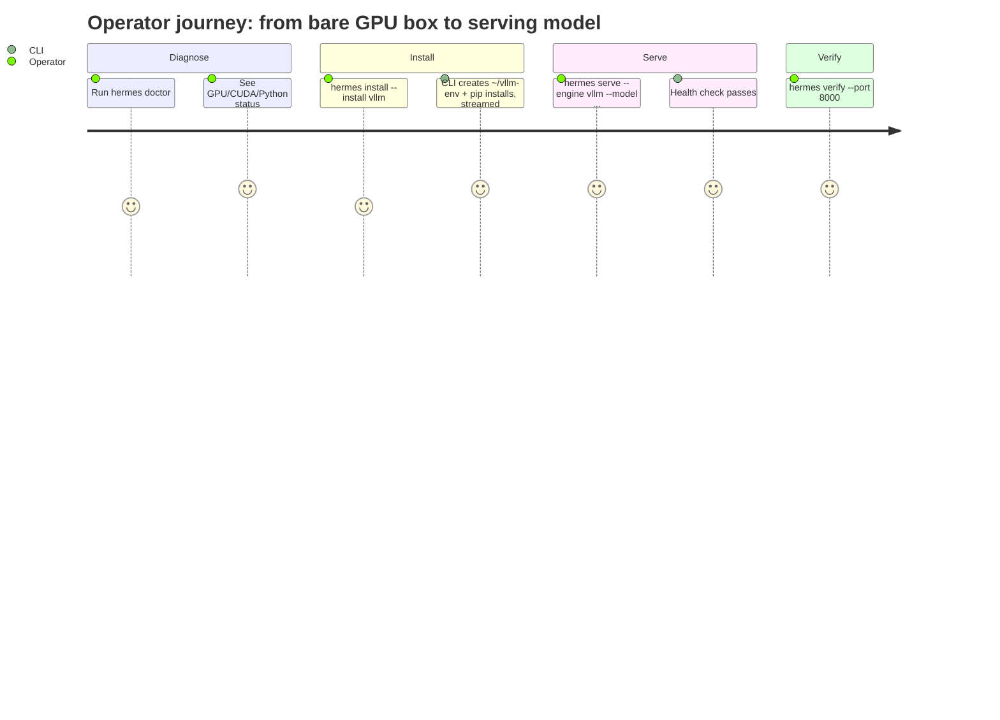

# PRODUCT_SENSE — Why Hermes CLI Exists

> Purpose, beliefs, and non-goals. Read before adding features so scope stays honest.

---

## 1. Product Purpose

Hermes CLI makes launching and monitoring SGLang, vLLM, and llama.cpp servers
a single, legible command. It removes the friction of hand-managing runtime
environments, engine flags, hardware defaults, and health checks.

## 2. Core Beliefs

1. **One command, predictable outcome.** The operator should not need to
   remember engine-specific incantations.
2. **The environment is the hard part.** Most failures are GPU/CUDA/venv issues;
   `doctor` and clear crash reasons matter more than fancy features.
3. **Engine-agnostic by design.** SGLang, vLLM, and llama.cpp share one
   lifecycle while explicit profiles preserve their runtime differences.
4. **Honest output.** Show the real crash reason immediately; never silently
   redirect failures into a log the operator has to hunt for.
5. **Minimal dependencies.** A static Go binary that shells out to
   `python3`/`pip` and `cmake` beats a heavyweight framework.

## 3. Non-Goals

- **Not** an inference engine — it launches upstream engines, it does not serve tokens.
- **Not** a model registry or downloader beyond what the engines already do.
- **Not** a cluster scheduler — single-host orchestration only.
- **Not** a GUI — terminal-first, scriptable.
- **Not** tied to one cloud or accelerator — it operates on one local host.

## 4. Primary Users

- ML engineers spinning up inference on a fresh GPU instance.
- Researchers comparing supported engines on one host.
- Ops automating model serving in scripts/CI.
