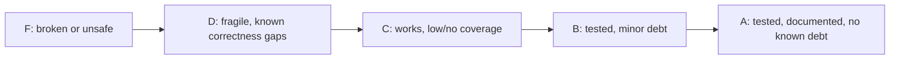

# QUALITY_SCORE — Domain Health

> Honest, day-0 grades. Update as domains improve or regress.

---

## 1. Domain Grades

| Domain | Grade | Notes |
|--------|-------|-------|
| `cmd/hermes` (entry/routing) | C | `realMain()` pattern; exit codes via `app.ExitError`. Still untested. |
| `internal/commands` | C | Process-lifecycle bugs fixed; still no command-level tests. |
| `internal/engine` | B | `ServeCommand` + arg splitting covered by tests. |
| `internal/config` | B | Default config helpers covered by tests. |
| `internal/execx` | B | `Run`/`RunWithTimeout`/`CommandExists` covered by tests. |
| `internal/ui` + `ui/tui` | C | Presentation only. |

## 2. Tech Debt Tracker

| ID | Area | Debt | Severity | Status |
|----|------|------|----------|--------|
| TD-1 | testing | No tests at all. Now covered: engine, args, config, execx. Commands/app still uncovered. | High | in_progress |
| TD-2 | engine | Version floors live in code (`vllm>=0.8`, `sglang>=0.5`); drift risk. | Med | open |
| TD-3 | ci | No CI enforcing fmt/vet/test. | Med | fixed (ci.yml) |
| TD-4 | commands | `serve --daemon` was killed on CLI exit (ctx-bound process). | High | fixed |
| TD-5 | commands | `doctor` called `os.Exit`, bypassing cleanup. | Med | fixed |
| TD-6 | app | Log file descriptor never closed (MultiWriter not a Closer). | Med | fixed |
| TD-7 | commands | Foreground `run` could not stop the engine on Ctrl+C. | High | fixed |
| TD-8 | engine | `--extra-args` split naively; sglang ignored it entirely. | Med | fixed |
| TD-9 | execx | No per-probe timeout; a hung tool could block `doctor`. | Med | fixed |
| TD-10 | commands | No `hermes stop`/`status`; daemons have no PID registry. | Med | open |
| TD-11 | commands | `verify --chat` hardcodes model `"default"`; should read `/v1/models`. | Low | open |
| TD-12 | ci | No `.golangci.yml`; no `go test -race`; no depguard for GP-1. | Low | open |
| TD-13 | config | Typed config structs (`DoctorConfig`, etc.) largely unused. | Low | open |

## 3. Grading Rubric

- **A** — >80% meaningful coverage, docs current, no open high-severity debt.
- **B** — core paths tested, only low/medium debt.
- **C** — compiles and runs, little/no automated coverage.
- **D** — known correctness or reliability gaps.
- **F** — broken, unsafe, or unbuildable.

## 4. Path to A (next steps)

1. Add command-level tests (doctor report logic, verify status, install-mode parsing).
2. Add `hermes stop`/`status` with a PID registry (TD-10).
3. Make `verify --chat` resolve the model from `/v1/models` (TD-11).
4. Add `.golangci.yml`, `go test -race`, and a depguard rule enforcing GP-1 (TD-12).
