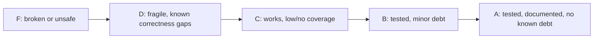

# QUALITY_SCORE — Domain Health

> Honest, day-0 grades. Update as domains improve or regress.

---

## 1. Domain Grades

| Domain | Grade | Notes |
|--------|-------|-------|
| `cmd/hermes` (entry/routing) | C | Works; no tests. |
| `internal/commands` | C | Functional; zero test coverage. |
| `internal/engine` | C | Clean interface; `ServeCommand` is pure and easily testable but untested. |
| `internal/config` | C | Simple structs; needs validation tests. |
| `internal/execx` | C | Process helpers untested. |
| `internal/ui` + `ui/tui` | C | Presentation only. |

Grading is intentionally conservative until tests exist.

## 2. Tech Debt Tracker

| ID | Area | Debt | Severity | Status |
|----|------|------|----------|--------|
| TD-1 | testing | No `*_test.go` anywhere; `just test` is a no-op. | High | open |
| TD-2 | engine | Version floors live in code (`vllm>=0.8`, `sglang>=0.5`); drift risk. | Med | open |
| TD-3 | ci | No CI enforcing fmt/vet/test until this bootstrap. | Med | addressed by ci.yml |

## 3. Grading Rubric

- **A** — >80% meaningful coverage, docs current, no open high-severity debt.
- **B** — core paths tested, only low/medium debt.
- **C** — compiles and runs, little/no automated coverage.
- **D** — known correctness or reliability gaps.
- **F** — broken, unsafe, or unbuildable.

## 4. Path to B (next steps)

1. Add table-driven tests for `engine.ServeCommand` (sglang + vllm).
2. Add validation tests for `config` defaults and install-mode parsing.
3. Cover `execx.Run` exit-code handling with a fake command.
