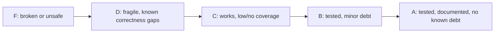

# QUALITY_SCORE — Domain Health

> Honest, day-0 grades. Update as domains improve or regress.

---

## 1. Domain Grades

| Domain | Grade | Notes |
|--------|-------|-------|
| `cmd/hermes` (entry/routing) | C | `realMain()` pattern; exit codes via `app.ExitError`. Still untested. |
| `internal/commands` | B− | Process-lifecycle fixed; `stop`/`status` added; port preflight, TP validation, daemon boot wait, and CUDA device selection added; characterization tests cover validation + env + doctor summary. |
| `internal/engine` | B | `ServeCommand` + arg splitting covered by tests. |
| `internal/config` | B | Default config helpers + `ValidateTP` covered by tests. |
| `internal/execx` | B | `Run`/`RunWithTimeout`/`CommandExists` covered by tests. |
| `internal/gpu` | B | New package; `Count`/`CountFromQueryOutput`/`ParseCUDADevices` covered by table-driven tests. |
| `internal/pidfile` | B | New daemon registry; write/read/list/remove/alive covered by tests. |
| `internal/ui` + `ui/tui` | C | Presentation only. |

## 2. Tech Debt Tracker

| ID | Area | Debt | Severity | Status |
|----|------|------|----------|--------|
| TD-1 | testing | No tests at all. Now covered: engine, args, config, execx, gpu, commands (characterization). ~20% commands coverage. | Med | in_progress |
| TD-2 | engine | Version floors live in code (`vllm>=0.8`, `sglang>=0.5`); drift risk. | Med | open |
| TD-3 | ci | No CI enforcing fmt/vet/test. | Med | fixed (ci.yml) |
| TD-4 | commands | `serve --daemon` was killed on CLI exit (ctx-bound process). | High | fixed |
| TD-5 | commands | `doctor` called `os.Exit`, bypassing cleanup. | Med | fixed |
| TD-6 | app | Log file descriptor never closed (MultiWriter not a Closer). | Med | fixed |
| TD-7 | commands | Foreground `run` could not stop the engine on Ctrl+C. | High | fixed |
| TD-8 | engine | `--extra-args` split naively; sglang ignored it entirely. | Med | fixed |
| TD-9 | execx | No per-probe timeout; a hung tool could block `doctor`. | Med | fixed |
| TD-10 | commands | No `hermes stop`/`status`; daemons had no PID registry. | Med | fixed |
| TD-11 | commands | `verify --chat` hardcoded model `"default"`; now resolves from `/v1/models`. | Low | fixed |
| TD-12 | ci | No `.golangci.yml`; no `go test -race`; no depguard for GP-1. | Low | fixed |
| TD-13 | config | Typed config structs largely unused. `DoctorConfig` removed; Install/Verify/Studio retained as documented+tested default surface. | Low | fixed |
| TD-14 | commands | `doctor` used broken `--query-gpu=count` query; GPU count always 0. | Med | fixed |
| TD-15 | commands | No port preflight; engine got "address already in use" from the OS. | Med | fixed |
| TD-16 | commands | Daemon crashes were invisible; CLI waited silently until timeout. | High | fixed |
| TD-17 | commands | TP default was 4 without checking GPU count; multi-GPU launches failed silently. | High | fixed |
| TD-18 | commands | Foreground `run` left orphaned pidfile records on exit. | Med | fixed |

## 3. Grading Rubric

- **A** — >80% meaningful coverage, docs current, no open high-severity debt.
- **B** — core paths tested, only low/medium debt.
- **C** — compiles and runs, little/no automated coverage.
- **D** — known correctness or reliability gaps.
- **F** — broken, unsafe, or unbuildable.

## 4. Path to A (next steps)

1. Increase command coverage beyond characterization tests (doctor report logic, verify status, stop/status with a fake pidfile dir, install-mode parsing).
2. Add a `hermes logs`/`hermes restart` convenience (follow-up to the daemon registry).
3. Expand `depguard` deny rules if new layers appear; pin golangci-lint v2 in CI.
