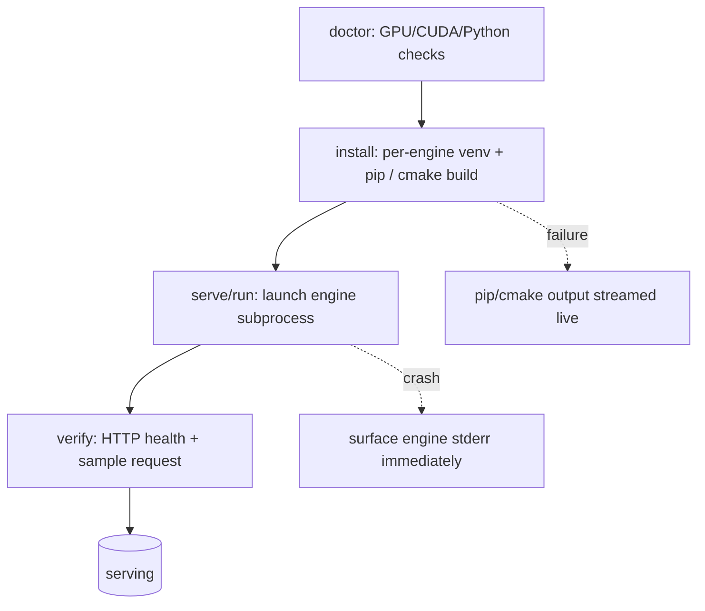
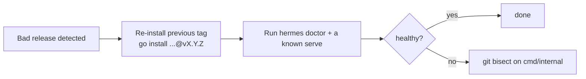

# RELIABILITY — SLOs, Critical Paths, Rollback

> Hermes CLI is a local orchestration tool, not a hosted service. "Reliability"
> here means predictable launches and safe failure, not uptime SLAs.

---

## 1. Reliability Targets

| Signal | Target | Rationale |
|--------|--------|-----------|
| `hermes doctor` accuracy | 100% truthful | Operators trust it to gate installs. |
| Serve launch → health-pass | < 90s for cached models | Detect hangs early, surface crash reason. |
| Crash visibility | Reason shown inline, not buried in logs | Core product belief (see PRODUCT_SENSE). |
| State file integrity | Never corrupts `~/.cache/hermes/state.json` | Best-effort writes, tolerate missing/garbled. |
| Config precedence | flags > project > user > built-in | Keep automation and host defaults predictable. |

## 2. Critical Paths

- **Auth/PII/payments:** none — mark N/A.
- **Process management:** the launched engine is the critical external dependency;
  always stream and surface its stderr.

## 3. Failure Modes & Handling

| Failure | Detection | Handling |
|---------|-----------|----------|
| `python3` or venv support missing | `execx.CommandExists` + `ensurepip` probe | Print `apt install python3-venv` hint; never run `sudo`. |
| llama.cpp build tools missing | `execx.CommandExists` for git/cmake/make | Print `apt install git cmake build-essential` hint. |
| `llama-server` missing or incompatible | bounded version/help probe (PATH, then `~/.local/bin`) | Offer the source-build install; report missing required flags. |
| Engine import fails | `CheckInstalled` exit code | Report "not installed", offer install path. |
| Port in use | `assertPortAvailable` via `net.Listen` | Refuse to start before engine launch, tell operator the port. |
| TP > GPU count | `gpu.Count` + `config.ValidateTP` | Refuse to start, report visible GPU count and requested TP. |
| Invalid `--cuda-devices` | `gpu.ParseCUDADevices` | Reject duplicates, non-integer, negative IDs before launch. |
| Engine crashes on boot | `pollProcessExit` (WNOHANG) + log tail | Print last 8KB of engine log inline, exit non-zero. |
| Daemon boot timeout | `waitForBoot` exceeds `--boot-timeout` | Terminate process group, print crash reason, exit non-zero. |
| Foreground run interrupted | `ownershipGuard` on SIGINT | Remove pidfile record, reap process group, exit cleanly. |
| Corrupt state.json | JSON unmarshal error | Reset to empty state, continue. |
| Corrupt config JSON | JSON unmarshal error | Refuse to launch and identify the invalid file. |

## 4. Rollback Policy

This is a CLI distributed as a binary; "rollback" means reverting a release.

- Tag every release; `just build` embeds `Version`/`Commit`/`BuildDate` via ldflags.
- No data migrations exist, so rollback is purely binary-swap — low risk.
