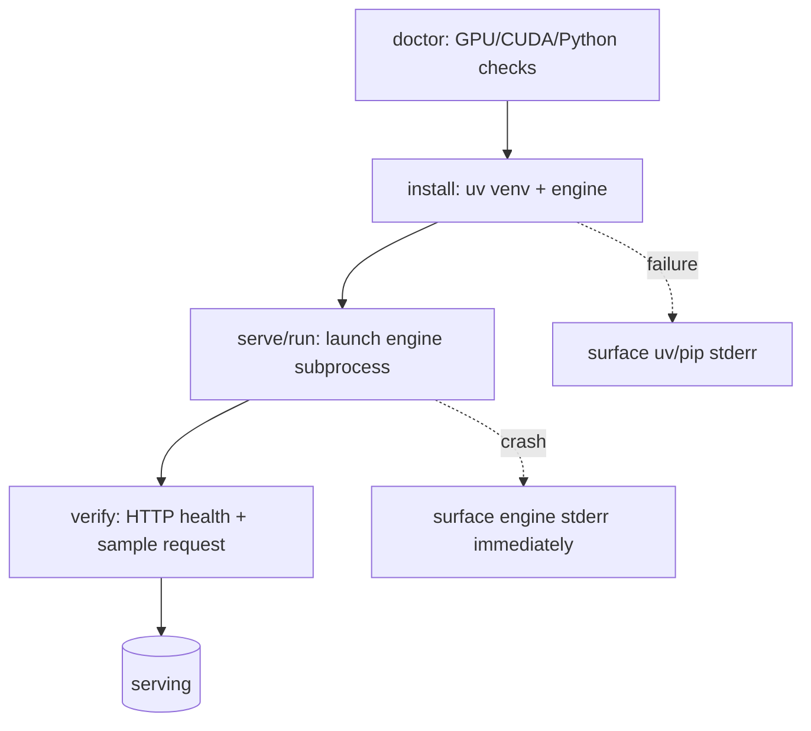
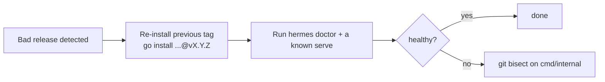

# RELIABILITY — SLOs, Critical Paths, Rollback

> Hermes CLI is a local orchestration tool, not a hosted service. "Reliability"
> here means predictable launches and safe failure, not uptime SLAs.

---

## 1. Reliability Targets

| Signal | Target | Rationale |
|--------|--------|-----------|
| `hermes doctor` accuracy | 100% truthful | Operators trust it to gate installs. |
| Serve launch → health-pass | < 90s for cached models | Detect hangs early, surface crash reason. |
| Crash visibility | Reason shown inline, not buried in logs | Core product belief (see PRODUCT_SENSE). |
| State file integrity | Never corrupts `~/.cache/hermes/state.json` | Best-effort writes, tolerate missing/garbled. |

## 2. Critical Paths

- **Auth/PII/payments:** none — mark N/A.
- **Process management:** the launched engine is the critical external dependency;
  always stream and surface its stderr.

## 3. Failure Modes & Handling

| Failure | Detection | Handling |
|---------|-----------|----------|
| `uv` missing | `execx.CommandExists` | Auto-install via official script, re-check. |
| Engine import fails | `CheckInstalled` exit code | Report "not installed", offer install path. |
| Port in use | pre-flight port check | Refuse to start, tell operator the port. |
| Engine crashes on boot | non-zero exit / stderr | Print crash reason inline, exit non-zero. |
| Corrupt state.json | JSON unmarshal error | Reset to empty state, continue. |

## 4. Rollback Policy

This is a CLI distributed as a binary; "rollback" means reverting a release.

- Tag every release; `make build` embeds `Version`/`Commit`/`BuildDate` via ldflags.
- No data migrations exist, so rollback is purely binary-swap — low risk.
