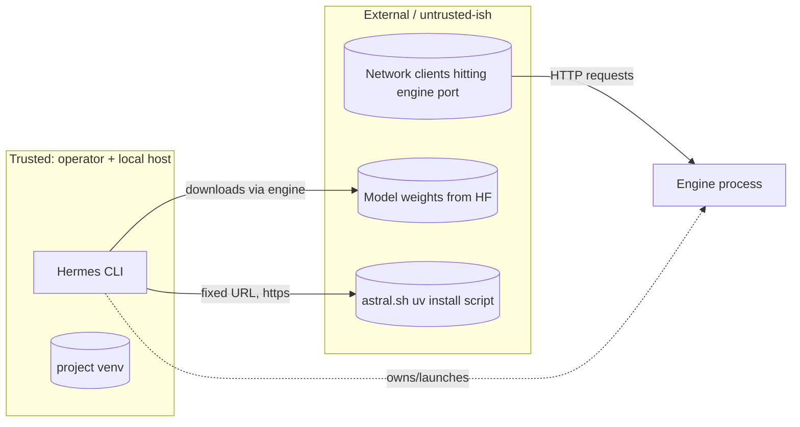

# SECURITY — Invariants & Patterns

> Hard rules that must always hold. Violations block merge.

---

## 1. Hard Invariants

1. **No secrets in code.** No API keys, tokens, or credentials as literals.
   Hugging Face tokens and similar come from the operator's environment.
2. **Validate all external input.** CLI flags, model paths, and `--extra-args`
   are validated/whitelisted before being passed to a subprocess.
3. **No untrusted shell interpolation.** Build process args as `[]string`
   (`execx.Run(ctx, bin, args...)`), never string-concatenate user input into
   `sh -c`. The single `sh -c` use (uv installer) runs a fixed, trusted URL.
4. **Least privilege.** Never invoke `sudo`. Engine installs go into a project
   venv, not system Python.
5. **Bind intentionally.** Default serve host is configurable; document that
   `0.0.0.0` exposes the engine on the network.

## 2. Trust Boundaries

## 3. `--extra-args` Risk

`--extra-args` forwards arbitrary flags to the engine. This is operator-supplied
and runs with the operator's privileges — acceptable for a local CLI, but:

- Never echo `--extra-args` into logs that might be shared without review.
- Document that operators are responsible for the flags they pass.

## 4. Data Classification

| Data | Class | Handling |
|------|-------|----------|
| Model weights | Public/Licensed | Downloaded by engine; respect licenses. |
| `~/.cache/hermes/state.json` | Non-sensitive | Install status + paths only; no secrets. |
| User/project Hermes config | Non-sensitive | Mode 0600; engine defaults only; no tokens. |
| HF tokens | Secret | From env only; never written to state or logs. |
| Engine stderr | Operational | May contain paths; surfaced to operator only. |

## 5. CI Enforcement

- **trufflehog** secret scan runs on every push/PR (see `.github/workflows/ci.yml`).
- `go vet` catches a class of unsafe patterns.
- Reviewers confirm GP-4 (no secrets) on any change touching config or install.
