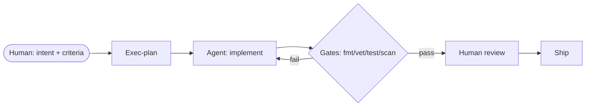

# Core Beliefs — Agent-First Development

> The operating philosophy behind this repository's structure.

1. **Humans steer. Agents execute.** Humans set intent and acceptance criteria;
   agents do the mechanical work against a legible, enforceable environment.
2. **The repository is ground truth.** Decisions live in `docs/`, not in chat or
   memory. If an agent can't read it in-context, it effectively does not exist.
3. **Map, not manual.** `AGENTS.md` points to sources of truth; it does not try
   to contain them.
4. **Plans before code.** Non-trivial work gets an exec-plan with explicit
   acceptance criteria before implementation begins.
5. **Golden principles are mechanical.** They are enforced by linters and CI, not
   by reviewer goodwill (see ARCHITECTURE.md §5).
6. **Honesty over optimism.** Day-0 grades are C; crash reasons are shown inline;
   docs are gardened to stay true.

