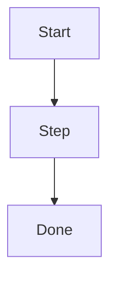

# Plan: <title>

## Intent

What outcome are we after, and why now?

## Acceptance Criteria

- [ ] Criterion 1 (observable, testable)
- [ ] Criterion 2
- [ ] Quality gate: `just check` passes

## Approach

High-level steps. Add a Mermaid diagram for any non-trivial flow:

## Non-Goals

- What this plan deliberately does not do.

## Risks & Mitigations

| Risk | Likelihood | Mitigation |
|------|-----------|------------|
| | | |

## Progress Log

| Date | Update |
|------|--------|
| YYYY-MM-DD | Created. |
