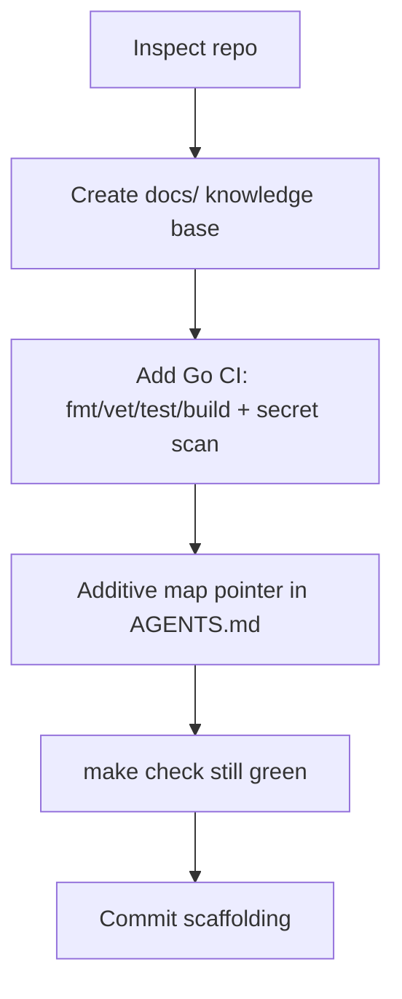

# Plan: Initial Project Setup

## Intent

Layer harness engineering structure onto the existing Hermes CLI repo so agents
can work effectively from any session, without disturbing existing Go code, the
bd-based `AGENTS.md`, or the README.

## Acceptance Criteria

- [x] docs/ knowledge base created (7 top-level docs)
- [x] docs/ subdirectories (design-docs, exec-plans, product-specs, references)
- [x] Mermaid diagrams used for architecture and complex concepts
- [x] Go-appropriate CI skeleton (.github/workflows/ci.yml)
- [x] Existing AGENTS.md & README preserved (additive pointer only)
- [ ] First real feature exec-plan created
- [ ] Tests added (see QUALITY_SCORE TD-1)

## Approach

## Non-Goals

- No product features implemented.
- No deployment/hosting configured.
- No overwrite of existing AGENTS.md, README, Makefile, or source code.
- `.opencode/` intentionally skipped (per operator decision).

## Risks & Mitigations

| Risk | Likelihood | Mitigation |
|------|-----------|------------|
| Docs drift from code | Med | Run doc-gardening after large changes; references list version floors. |
| CI flaky on Go version | Low | Pin Go via go.mod toolchain; matrix kept minimal. |

## Progress Log

| Date | Update |
|------|--------|
| 2026-06-28 | Bootstrapped harness docs + Go CI onto existing repo. |
