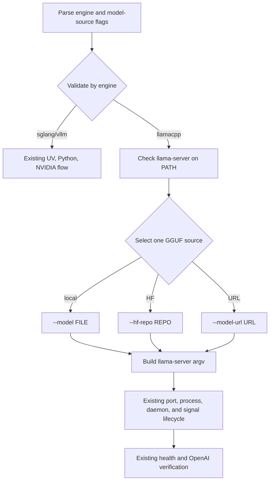

# Plan: llama.cpp Engine Support

Tracking issue: `hermes-cli-ak7`

## Intent

Add `llamacpp` as a third Hermes inference engine backed by the native
`llama-server` executable. The first release will support preinstalled
llama.cpp across CPU, Metal, and CUDA hosts while reusing Hermes' existing
process lifecycle, readiness, verification, daemon, and port-safety behavior.

Unlike SGLang and vLLM, llama.cpp is not a Python package, consumes GGUF
models, and does not use tensor-parallel world-size semantics. The integration
must make those differences explicit instead of forcing them through the
current `uv` and NVIDIA-only assumptions.

## Confirmed Product Decisions

- Public engine identifier: `llamacpp`.
- Executable: `llama-server` discovered on `PATH`.
- Installation: preinstalled binary only. Hermes reports actionable setup
  guidance but does not invoke Homebrew, download release archives, build from
  source, or use Docker.
- Platforms: CPU, Metal, and CUDA are supported. Absence of NVIDIA hardware is
  not a llama.cpp failure.
- Model sources: exactly one of local GGUF (`--model`), Hugging Face GGUF repo
  (`--hf-repo`), or remote GGUF URL (`--model-url`).
- Model URLs are public HTTP(S) URLs only. User info, query strings, and
  fragments are rejected; authenticated downloads use `HF_TOKEN` with
  `--hf-repo`.
- GPU control: expose `--gpu-layers`; require `--tp=1` for llama.cpp.
- Advanced multi-GPU controls remain available through `--extra-args` until a
  dedicated design covers `--device`, `--split-mode`, `--tensor-split`, and
  `--main-gpu`.
- Existing `install --install both` continues to mean SGLang + vLLM.

## Acceptance Criteria

- [ ] `engine.Get(config.EngineLlamaCpp)` returns a `LlamaCppEngine`.
- [ ] `llama-server --version` detects a preinstalled binary, while a bounded
      `--help` probe verifies the required flags. Detection reports its version
      without requiring Python, `uv`, CUDA, or `nvidia-smi`.
- [ ] `hermes serve --engine llamacpp` and `hermes run --engine llamacpp`
      support one, and only one, of:
      - `--model /path/to/model.gguf`
      - `--hf-repo owner/repository[:quant]`
      - `--model-url https://host/model.gguf`
- [ ] Local model input must resolve to a regular `.gguf` file before launch.
- [ ] Model URLs accept only public HTTP(S) URLs without user info, query
      strings, or fragments and are passed as an argument slice, never a shell
      string.
- [ ] llama.cpp rejects Hermes-owned flags and aliases (`-m`/`--model`,
      `-hf`/`--hf-repo`, `-mu`/`--model-url`, `--host`, `--port`, and
      `-ngl`/`--gpu-layers`/`--n-gpu-layers`) when duplicated through
      `--extra-args`, including `--flag=value` forms.
- [ ] `--gpu-layers N` maps to `llama-server --gpu-layers N`; the flag is
      omitted when unset and rejected for SGLang/vLLM.
- [ ] llama.cpp rejects `--tp` values other than `1` and skips NVIDIA GPU-count
      capacity validation.
- [ ] SGLang and vLLM retain current tensor-parallel, CUDA-device, install, and
      doctor behavior.
- [ ] `hermes run --engine llamacpp` performs engine-aware doctor/install
      phases and does not install `uv`, create a Python venv, or require
      NVIDIA.
- [ ] `hermes install --install llamacpp` succeeds when `llama-server` is
      present and otherwise returns a clear manual-install instruction.
- [ ] Existing `/health`, `/v1/models`, and `/v1/chat/completions` readiness
      and verification paths work without llama.cpp-specific forks.
- [ ] `hermes run --engine llamacpp` performs readiness and model-list
      verification without forcing a chat request; chat remains opt-in through
      `hermes verify --chat`.
- [ ] Daemon records, stop/status behavior, crash-tail reporting, port
      preflight, signal cleanup, and `CUDA_VISIBLE_DEVICES` injection remain
      functional.
- [ ] Unit and command-characterization tests cover the new engine, model
      source validation, engine-aware requirements, URL/extra-argument safety,
      and regression behavior for SGLang/vLLM.
- [ ] Raw `--extra-args` are no longer echoed to UI or debug logs for any
      engine; they are parsed once into `ServeConfig.ExtraArgs []string`, and
      command logging records only that extra arguments are present.
- [ ] Release qualification records a smoke test against a real, supported
      `llama-server` build for `/health`, `/v1/models`, and, with a chat-capable
      GGUF, `/v1/chat/completions`.
- [ ] User-facing help and source-of-truth docs describe GGUF requirements,
      preinstallation, platform behavior, and the non-equivalence of `--tp`.
- [ ] Quality gate: `just check` passes.

## CLI Contract

```text
hermes serve --engine llamacpp --model ./model.gguf
hermes serve --engine llamacpp --hf-repo owner/model-GGUF:Q4_K_M
hermes serve --engine llamacpp --model-url https://models.example/model.gguf
hermes serve --engine llamacpp --model ./model.gguf --gpu-layers 99
```

New shared flags:

| Flag | Default | llama.cpp behavior | Other engines |
|------|---------|--------------------|---------------|
| `--hf-repo` | empty | Selects `llama-server --hf-repo` | rejected |
| `--model-url` | empty | Selects `llama-server --model-url` | rejected |
| `--gpu-layers` | `-1` (unset) | Emits value when `>= 0` | rejected |

Validation rules:

1. llama.cpp requires exactly one model source.
2. SGLang/vLLM continue to require `--model` and reject llama.cpp-only flags.
3. llama.cpp requires `--tp=1`; SGLang/vLLM keep current TP validation.
4. `--model-url` must parse as HTTP(S) and reject URL user info, query strings,
   and fragments.
5. `--hf-repo` must be non-empty after trimming and contain no whitespace.
6. `--gpu-layers` accepts `-1` as "engine default" and non-negative values.
7. llama.cpp rejects all reserved long/short aliases and `--flag=value` forms
   in `--extra-args`. The quote-aware parser used for command construction is
   also used for validation and returns an error for unterminated quotes.

## Approach



### 1. Represent Engine Requirements and llama.cpp Configuration

Files:

- `internal/config/config.go`
- `internal/config/config_test.go`
- `internal/engine/engine.go`
- `internal/engine/engine_test.go`

Changes:

- Add `config.EngineLlamaCpp = "llamacpp"` and
  `config.InstallLlamaCpp = "llamacpp"`.
- Extend `ServeConfig` with `HFRepo`, `ModelURL`, and `GPULayers`.
- Change `ServeConfig.ExtraArgs` from a raw string to `[]string`; command
  boundaries parse it once and engine adapters append the validated tokens.
- Add one `Profile() RuntimeProfile` method to `Engine`. Keep the profile
  finite and small: runtime/install strategy (`UVPython` or
  `PreinstalledNative`), `RequiresNVIDIA`, and `SupportsTensorParallel`.
  Avoid a broad matrix of loosely related booleans.
- Add `config.ParseEngine` so `serve`, `run`, `doctor`, install resolution, and
  tests do not maintain separate engine lists.
- Preserve `InstallBoth` semantics for backward compatibility.

### 2. Implement the Native llama.cpp Adapter

Files:

- `internal/engine/llamacpp.go` (new)
- `internal/engine/engine.go`
- `internal/engine/engine_test.go`

Behavior:

- `Name()` returns `llamacpp`.
- `CheckInstalled` checks `llama-server` on `PATH`, runs
  `llama-server --version` with the existing bounded execution helpers, and
  reports stdout or stderr as version text. It then inspects bounded
  `llama-server --help` output for the required model-source, host, port, and
  GPU-layer flags, distinguishing "missing" from "installed but unsupported."
- `Install` returns an actionable manual-install error when the binary is
  absent; it never invokes a package manager or shell installer.
- `ServeCommand` emits:
  - the selected model source,
  - `--host` and `--port`,
  - optional `--gpu-layers`,
  - quote-aware `--extra-args`.
- Tests assert exact argv for local, HF, and URL sources and confirm no Python
  or `uv` wrapper is used.

### 3. Add Engine-Aware Input and GPU Validation

Files:

- `internal/commands/serve.go`
- `internal/commands/run.go`
- `internal/commands/commands_test.go`
- `internal/commands/serve_test.go`

Changes:

- Parse the three model-source flags and `--gpu-layers` in both `serve` and
  `run`.
- Extract pure validation helpers so invalid combinations are testable without
  launching a process.
- Export/reuse the existing quote-aware extra-argument parser from
  `internal/engine/args.go`, change it to return `([]string, error)`, and parse
  once before constructing `ServeConfig`. Validate reserved aliases plus
  `--flag=value` forms against those tokens; engine adapters do not reparse.
- Validate local GGUF paths using `os.Stat`, regular-file checks, and a
  case-insensitive `.gguf` suffix.
- Route SGLang/vLLM through existing `validateTensorParallel`.
- Route llama.cpp through a capability-aware check that enforces TP=1 and does
  not query NVIDIA GPU count.
- Keep `--cuda-devices` as an optional CUDA-only environment filter. Do not
  claim it selects Metal, Vulkan, HIP, or SYCL devices.

### 4. Separate Native and Python Install Paths

Files:

- `internal/commands/install.go`
- `internal/commands/run.go`
- `internal/commands/install_test.go` (new)

Changes:

- Add `selectedEngines(mode)` and only probe, prepare, and install the selected
  engines. Run `ensureUV`/`setupVenv` only if at least one selected engine uses
  the `UVPython` profile.
- Add `llamacpp` install mode; leave `both` unchanged and do not add `all` in
  this release.
- Make an omitted `run --install` engine-aware without adding a public `auto`
  value: install or validate only the engine selected by `--engine`. Explicit
  `--install both` retains its existing SGLang + vLLM meaning.
- For `run --engine llamacpp`, accept only omitted
  `--install`, `--install llamacpp`, or `--install none`;
  reject Python-engine modes so the native path cannot trigger `uv` or venv
  setup. Existing SGLang/vLLM explicit-mode behavior remains unchanged.
- `install --install llamacpp --check` must never invoke `uv`, venv setup,
  Python, or NVIDIA probes.
- Keep `install --check` read-only. Do not persist llama.cpp state because a
  preinstalled `PATH` binary can change independently; probe it on each
  invocation.
- Tests use a temporary executable on `PATH` to characterize present/missing
  `llama-server` behavior without network or package-manager access.

### 5. Make Doctor Engine-Aware

Files:

- `internal/commands/doctor.go`
- `internal/commands/run.go`
- `internal/commands/doctor_test.go`

Changes:

- Add optional `doctor --engine sglang|vllm|llamacpp`.
- Preserve the current no-engine doctor report for compatibility.
- SGLang/vLLM requirements remain NVIDIA + Python/`uv`.
- llama.cpp checks the `llama-server` binary and version. No accelerator is a
  valid CPU configuration; backend/device discovery is deferred.
- Define one profile-driven requirement selector used by both `Doctor` and
  `runDoctorPhase`; do not maintain two check lists.
- Requirement/fatality matrix:

| Invocation | Required | Informational or remediable |
|------------|----------|-----------------------------|
| `doctor` without engine | Preserve current NVIDIA/CUDA/GPU/uv/Python behavior | Preserve current strict-mode semantics |
| `doctor --engine sglang|vllm` | NVIDIA visibility | CUDA compiler, `uv`, and Python retain current warning behavior |
| `doctor --engine llamacpp` | Present and flag-compatible `llama-server` | Accelerator/backend discovery is not required |
| `run --engine sglang|vllm` | Preserve current NVIDIA gate | `uv`/Python may be remediated by install |
| `run --engine llamacpp` | Present and flag-compatible `llama-server` | CPU-only execution is valid |

### 6. Keep Model References and Extra Arguments Safe

Files:

- `internal/commands/serve.go`
- `internal/commands/serve_test.go`

Changes:

- Reject model URLs containing user info, query strings, or fragments before
  process construction. Public URLs may be displayed and persisted normally.
- Parse raw `--extra-args` once, then discard the raw string.
- Stop echoing extra-argument values in `runServe` and debug command logging;
  record only a boolean or argument count. Continue passing the parsed values
  directly to `exec.CommandContext`.
- Document that upstream engines may log their own arguments. Operators must
  not pass secrets through `--extra-args`.
- Continue inheriting `HF_TOKEN` from the environment; never add tokens to CLI
  flags, config state, or logs.

### 7. Preserve API and Lifecycle Reuse

Files:

- `internal/commands/boot_test.go`
- `internal/commands/verify_test.go` (new if needed)

Changes:

- Keep existing generic readiness and verification characterization tests;
  do not add llama.cpp-labelled fake HTTP tests that cannot prove upstream
  compatibility.
- Add only regression tests needed to confirm the shared launch flow remains
  engine-neutral.
- Keep chat verification optional because base GGUF models may lack a usable
  chat template. `run` skips chat for llama.cpp; `verify --chat` remains
  available explicitly.
- Require a recorded real `llama-server` smoke test before release as the
  compatibility proof for `/health`, `/v1/models`, and
  `/v1/chat/completions`. It is a release gate rather than a hermetic unit
  test.

### 8. Update User and Architecture Documentation

Files:

- `cmd/hermes/main.go`
- `cmd/hermes/main_test.go` (new)
- `README.md`
- `AGENTS.md`
- `docs/ARCHITECTURE.md`
- `docs/DESIGN.md`
- `docs/PRODUCT_SENSE.md`
- `docs/RELIABILITY.md`
- `docs/SECURITY.md`
- `docs/QUALITY_SCORE.md`
- `docs/references/README.md`

Document:

- `llamacpp` examples for all three model sources.
- GGUF-only model support and chat-template caveats.
- Preinstalled binary requirement and upstream build/install links.
- CPU/Metal/CUDA scope and CUDA-only meaning of `--cuda-devices`.
- `--gpu-layers` behavior and why `--tp` must remain `1`.
- Public model-URL restrictions, extra-argument handling, and environment-only
  Hugging Face tokens.
- Native versus Python engine requirements in architecture diagrams.

Add top-level help characterization so future engines cannot be registered
without appearing in `hermes help`.

The legacy `hermes.sh` implementation is intentionally not extended.

## Test Matrix

| Area | Cases |
|------|-------|
| Engine registry | sglang, vllm, llamacpp, unknown |
| Command construction | local GGUF, HF repo, model URL, GPU layers set/unset, quoted extra args |
| Model validation | none selected, multiple selected, missing local file, directory, non-GGUF, invalid URL scheme, whitespace HF repo |
| TP/GPU validation | llama.cpp TP=1 accepted; TP>1 rejected; no NVIDIA probe; existing engines unchanged |
| Installation | selected-engine resolution; binary present/unsupported/absent; no `uv`/venv side effect; check mode read-only; existing state JSON unchanged |
| Doctor | default report unchanged, llama.cpp CPU-only accepted, version/capability probe failure surfaced |
| Security | model URL credentials/query/fragment rejected; reserved aliases and `--flag=value` rejected; malformed quotes rejected; extra args parsed once and values not echoed |
| Lifecycle | readiness success, early crash, timeout, signal cleanup, pidfile cleanup |

## Non-Goals

- Automatic Homebrew, release-archive, source-build, or container installation.
- Reinterpreting `--tp` as llama.cpp multi-GPU splitting.
- First-class `--device`, `--split-mode`, `--tensor-split`, `--main-gpu`,
  context-size, alias, embedding, reranking, speculative decoding, or multimodal
  flags.
- Automatic conversion of Transformers/safetensors models to GGUF.
- A Hermes model registry, downloader, cache manager, or GGUF quantizer.
- Authentication configuration for the served API.
- Extending the legacy Bash implementation.

## Risks & Mitigations

| Risk | Likelihood | Mitigation |
|------|-----------|------------|
| llama.cpp CLI changes on rolling releases | High | Keep adapter small, test exact argv, link a tested build/commit in release notes, avoid experimental flags. |
| Existing Python assumptions leak into native flow | Med | Add engine requirements and regression tests proving no `uv`, venv, Python, or NVIDIA dependency. |
| `--tp` is mistaken for llama.cpp splitting | High | Reject values other than 1 and document dedicated future multi-GPU design. |
| Model URL embeds credentials | Low | Reject user info, query strings, and fragments; direct authenticated users to `HF_TOKEN` + `--hf-repo`. |
| HF repo contains no compatible GGUF | Med | Surface llama-server stderr immediately; document GGUF requirement and quantization suffix. |
| Base model has no chat template | Med | Keep readiness model-based and chat verification optional with actionable failure output. |
| CPU launch is unexpectedly slow | Med | Preserve configurable readiness timeout and show honest boot progress/crash output. |
| Cross-platform device naming differs | High | Do not add generic device selection; limit first-class acceleration control to GPU layer count. |

## Rollout and Validation

1. Land capability/config changes with regression tests.
2. Land the llama.cpp adapter and command validation.
3. Land install/doctor separation and model-input safety.
4. Run `just check`.
5. Before release, provision a recorded supported `llama-server` build and
   small GGUF, then run smoke tests for:
   - CPU/local GGUF,
   - platform accelerator with `--gpu-layers`,
   - daemon readiness and stop/status,
   - one HF repo or model URL.
6. Release behind the explicit `--engine llamacpp` selector; no default engine
   changes are required.

Rollback is additive: remove llama.cpp registration and flags. Existing
SGLang/vLLM state and behavior must remain valid throughout.

## References

- [llama.cpp repository](https://github.com/ggml-org/llama.cpp)
- [llama-server documentation](https://github.com/ggml-org/llama.cpp/blob/master/tools/server/README.md)
- [llama.cpp build guide](https://github.com/ggml-org/llama.cpp/blob/master/docs/build.md)
- [llama.cpp multi-GPU guide](https://github.com/ggml-org/llama.cpp/blob/master/docs/multi-gpu.md)
- [llama.cpp releases](https://github.com/ggml-org/llama.cpp/releases)

## Progress Log

| Date | Update |
|------|--------|
| 2026-07-11 | Researched Hermes integration seams and current llama-server behavior. |
| 2026-07-11 | Scope confirmed: preinstalled cross-platform binary, local/HF/URL GGUF, GPU layers only, TP fixed at 1. |
| 2026-07-11 | Draft implementation plan created; no production code changed. |
| 2026-07-11 | Architecture and simplicity reviews approved the amended plan; implementation tracked in `hermes-cli-ak7`. |
| 2026-08-18 | Implemented engine, model safety, native install/doctor paths, lifecycle integration, and tests. Real GPU/llama-server release smoke test remains. |
