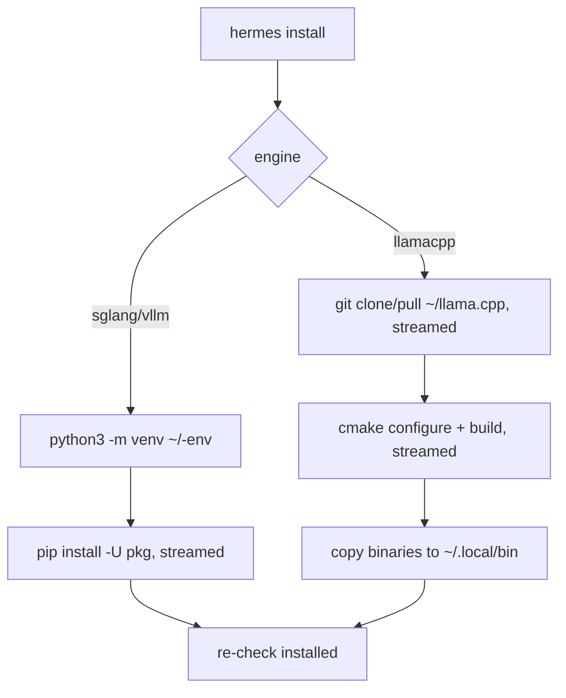

# Plan: Spec-aligned streamed engine install

## Intent

`hermes install` currently installs through `uv` into one shared venv and captures
all subprocess output, so the user stares at a silent terminal for many minutes.
Rework install to mirror the proven Ubuntu one-liner spec (without `sudo`) and
stream every step live:

- SGLang: `python3 -m venv ~/sglang-env` then `pip install -U "sglang[all]"`.
- vLLM: `python3 -m venv ~/vllm-env` then `pip install -U vllm`.
- llama.cpp: clone `~/llama.cpp`, `cmake` Release build (`-DGGML_CUDA=ON` when an
  NVIDIA GPU and `nvcc` are present), install `llama-server`/`llama-cli` into `~/.local/bin`.

Each Python engine gets its own venv (spec: isolation avoids dependency
conflicts). Missing prerequisites (git, cmake, python3 venv support) produce an
actionable `apt install` hint; Hermes never runs `sudo`.

## Acceptance Criteria

- [ ] `hermes install --install sglang|vllm` creates the per-engine venv and
      streams venv/pip output live to the terminal.
- [ ] `hermes install --install llamacpp` clones/builds llama.cpp from source,
      installs binaries into `~/.local/bin` without sudo, and streams output.
- [ ] CUDA builds: require `nvcc` and add `-DGGML_CUDA=ON` when `nvidia-smi` is present.
- [ ] `hermes install --install all` installs all three engines.
- [ ] `serve`/`run` auto-detect the per-engine venv binaries; explicit
      `venv_path` in settings still wins (backwards compatibility).
- [ ] `doctor` checks `python3` + `ensurepip` (python3-venv) instead of `uv`.
- [ ] No `uv` requirement anywhere in the install path.
- [ ] Quality gate: `just check` passes.

## Approach

1. Engine interface: `Install(ctx, stdout, stderr io.Writer)`; drop
   `EnvironmentEngine`/`InstallIn` (engines own their environments).
2. SGLang/vLLM: `DefaultVenvPath()` = `~/sglang-env` / `~/vllm-env`;
   `CheckInstalled` probes the venv first, then only launchable PATH/system fallbacks;
   `ServeCommand` prefers configured venv, then default venv, then PATH/system execution.
3. LlamaCpp: source-build `Install` with prereq check, clone/pull, cmake
   (CUDA auto), parallel build, Go-side copy into `~/.local/bin`, PATH warning;
   `CheckInstalled` also probes `~/.local/bin/llama-server`.
4. `install` command: drop `ensureUV`/shared venv, add `all` mode, stream via
   `execx.RunWithStreaming`, persist llama.cpp state.
5. `doctor`/`run`: replace the `uv` check with a `python3` + `ensurepip` check.
6. `setup`: drop the shared managed `--venv` flag; engines self-locate.

## Non-Goals

- Running `sudo` or apt commands on the user's behalf (we only print hints).
- Windows support for the source build.
- Pinning exact engine versions (spec uses `-U`, latest).

## Risks & Mitigations

| Risk | Likelihood | Mitigation |
|------|-----------|------------|
| `~/llama.cpp` exists but is not our clone | Low | Refuse with a clear error; never delete user data. |
| `~/.local/bin` not on PATH | Medium | Warn with the exact `export PATH=...` line after install. |
| Ubuntu lacks `python3-venv` | Medium | Detect `ensurepip` failure, print `sudo apt install python3-venv` hint. |
| NVIDIA GPU is visible but `nvcc` is missing | Medium | Stop before cloning/building and print an actionable CUDA toolkit requirement. |
| Existing configs with `venv_path` | Low | Field still honored as an explicit override. |

## Progress Log

| Date | Update |
|------|--------|
| 2026-08-18 | Created; issue hermes-cli-dw5. |
