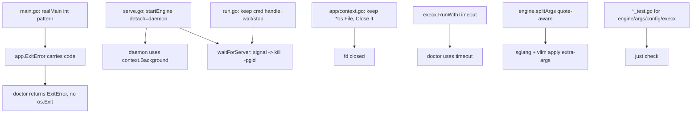

# Plan: Correctness fixes + initial test suite

## Intent

Resolve the Priority 1 & 2 issues found in the codebase review and seed the
first automated tests, so the engine/arg/config logic is covered and the
process-lifecycle bugs no longer strand or kill servers unexpectedly.

## Acceptance Criteria

- [x] `main` uses a `realMain() int` pattern; no command calls `os.Exit` directly,
      and `appCtx.Close()` always runs (doctor included).
- [x] `hermes serve --daemon` survives CLI exit (engine not killed by context cancel).
- [x] Foreground `hermes run` stops the engine on Ctrl+C (process group SIGTERM).
- [x] Log file descriptor is closed on shutdown (no fd leak).
- [x] External `doctor` calls have a timeout and cannot hang the CLI.
- [x] `--extra-args` is split with quote-awareness and applied to BOTH sglang and vllm.
- [x] Tests cover: engine `ServeCommand`, arg splitting, config defaults, execx exit codes.
- [x] `just check` passes.

## Approach

## Non-Goals

- No `hermes stop`/`status` command or PID-file registry yet (follow-up).
- No golangci-lint config or `-race` CI wiring yet (tracked separately).
- No new third-party dependencies (arg splitter implemented in-repo).

## Risks & Mitigations

| Risk | Likelihood | Mitigation |
|------|-----------|------------|
| Process-group signal change regresses foreground serve | Med | Manual reasoning + keep existing foreground behavior; Setpgid consistent. |
| Daemon detach leaks log fd in child | Low | Parent closes its copy; child keeps inherited fd by design. |

## Progress Log

| Date | Update |
|------|--------|
| 2026-06-28 | Plan created; implementing P1/P2 fixes + tests. |
| 2026-06-28 | All P1/P2 fixes landed; tests added (engine/args/config/execx); `just check` green. Done. |
