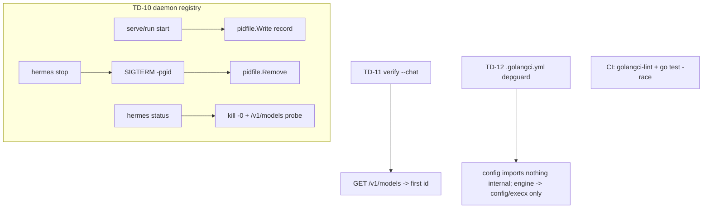

# Plan: Daemon management + verify fix + lint tooling

## Intent

Clear the remaining review follow-ups (TD-10..TD-13): give operators a way to
manage background engines, make `verify --chat` actually work, and make the
golden principles + quality bar mechanically enforced.

## Acceptance Criteria

- [x] TD-10: `internal/pidfile` records daemons; `hermes stop` and `hermes status`
      manage them (start writes a record, stop SIGTERMs the process group).
- [x] TD-11: `verify --chat` resolves the model id from `/v1/models` (falls back
      to `default` only if discovery fails).
- [x] TD-12: `.golangci.yml` with depguard encoding GP-1 dependency direction;
      `just check` and CI run `go test -race`; CI runs golangci-lint.
- [x] TD-13: unused typed config structs either wired in or removed.
- [x] `just check` passes.

## Approach

## Non-Goals

- No supervision/restart-on-crash; stop/status are manual.
- No Windows support (uses unix process groups, as the rest of the tool does).

## Risks & Mitigations

| Risk | Likelihood | Mitigation |
|------|-----------|------------|
| Stale PID records after hard kill | Med | `status` prunes records whose pid is dead. |
| golangci-lint unavailable locally | High | Config kept standard; CI runs it; `just check` degrades gracefully. |

## Progress Log

| Date | Update |
|------|--------|
| 2026-06-28 | Plan created; implementing TD-10..TD-13. |
| 2026-06-28 | pidfile + stop/status landed; verify model resolution; .golangci.yml + race + CI; DoctorConfig removed; just check green. Done. |
