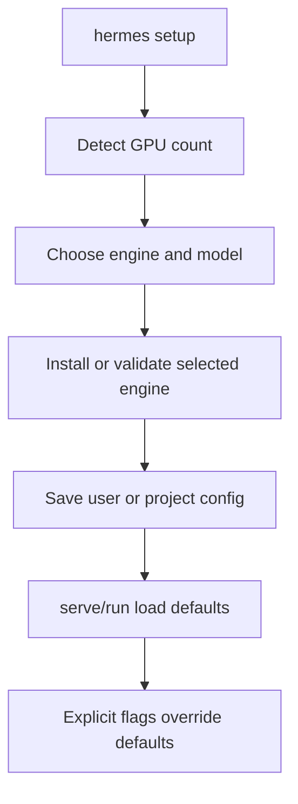

# Plan: GPU Setup and Persistent Config

## Intent

Make first use on a GPU host a guided, one-command experience while keeping
every command scriptable. Add `hermes setup` to detect available GPUs, select
and install an engine, and persist reusable defaults at user or project scope.

## Acceptance Criteria

- [x] `hermes setup` guides engine, model source, GPU defaults, scope, and installation.
- [x] User config uses the platform config directory; project config uses `.hermes.json`.
- [x] Project defaults override user defaults, and explicit CLI flags override both.
- [x] GPU detection suggests TP for SGLang/vLLM without affecting llama.cpp's TP=1 rule.
- [x] Setup can be driven entirely by flags for remote and automated GPU hosts.
- [x] Existing commands behave as before when no config exists.
- [x] Quality gate: `just check` passes.

## Approach

Use JSON and the standard library to avoid adding a configuration dependency.
Load user config first, then project config. Setup flags provide a deterministic
non-interactive path; missing values are collected with the existing Huh UI.

## Non-Goals

- Managing secrets or Hugging Face tokens in config.
- Installing GPU drivers, CUDA, or llama.cpp.
- Sharing machine-specific project config automatically.

## Risks & Mitigations

| Risk | Likelihood | Mitigation |
|------|-----------:|------------|
| Saved defaults surprise scripts | Medium | Existing behavior remains when absent; explicit flags always win. |
| GPU auto-detection fails | Medium | Fall back to TP=1 and allow overrides. |
| Project config leaks local paths | Low | Require explicit project scope and never store tokens. |

## Progress Log

| Date | Update |
|------|--------|
| 2026-08-18 | Scope confirmed: dedicated setup command with user and project config. |
| 2026-08-18 | Implemented and validated with `just check` plus a non-interactive CLI smoke test. |
