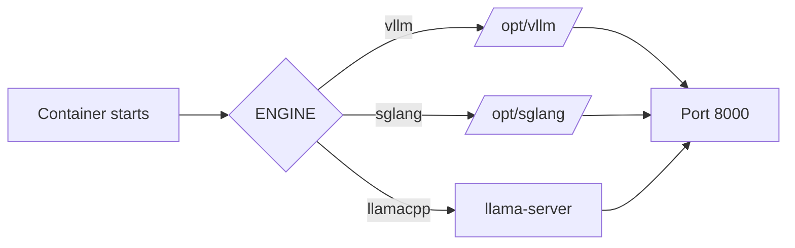

# Unified Inference Container

## Problem

Installing vLLM, SGLang, and llama.cpp directly on a host is slow and fragile.
Their CUDA and Python dependencies also conflict when installed into one runtime.

## Desired Behaviour

Hermes provides one CUDA 13.0.2 image with three isolated engine runtimes. A
container dispatches to exactly one engine and serves one model on port 8000.
Operators select the engine with `ENGINE=vllm|sglang|llamacpp`, provide `MODEL`,
and pass engine-specific options as container arguments.

## Requirements

- Build from NVIDIA CUDA 13.0.2 development and runtime images.
- Keep vLLM and SGLang in separate Python virtual environments with pinned CUDA-compatible wheel sources.
- Build one CUDA-enabled `llama-server` for architectures 80, 86, 89, 90, 100, 103, and 120.
- Never load or launch more than one engine per container.
- Require `MODEL`; default `ENGINE` to `vllm` and reject unknown values before launch.
- Forward container arguments unchanged to the selected engine.
- Run as a non-root user and keep Hugging Face, vLLM, and GGUF caches on `/models`.
- Document NVIDIA driver/toolkit, GPU, IPC/shared-memory, cache-volume, and
  per-engine run requirements.

## Acceptance Criteria

- [x] The dispatcher selects vLLM, SGLang, or llama.cpp and uses port 8000.
- [x] Dispatcher tests cover llama.cpp argument forwarding and invalid input.
- [x] The Dockerfile has separate build/runtime stages and no system Python
      environment shared by vLLM and SGLang.
- [x] Container documentation shows one-engine-per-container `docker run` examples.
- [x] `just check` validates the dispatcher and passes the existing Go gates.

## Non-Goals

- Running multiple inference engines in one container.
- Replacing the existing host-native `hermes install` flow.
- Kubernetes manifests, service-mesh routing, or multi-node NCCL setup.
- Publishing three thin engine-specific images in this iteration.
